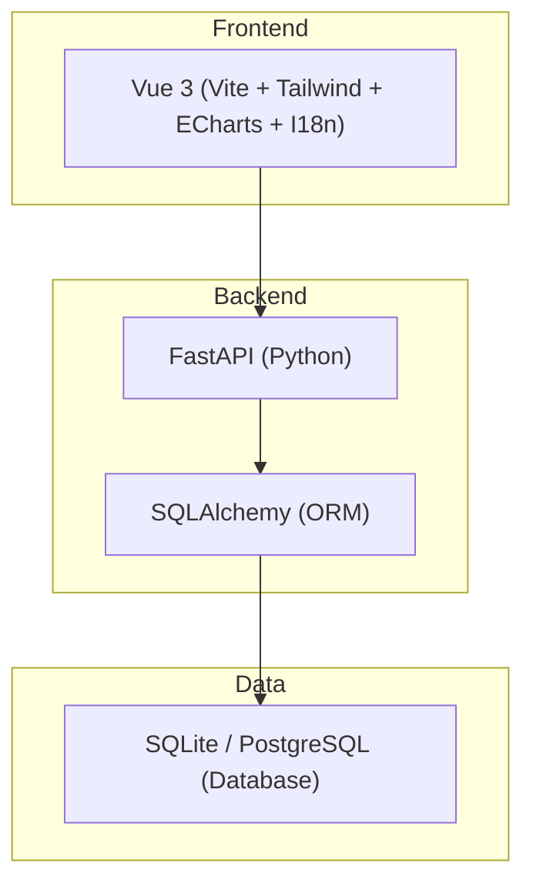
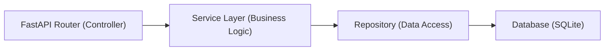
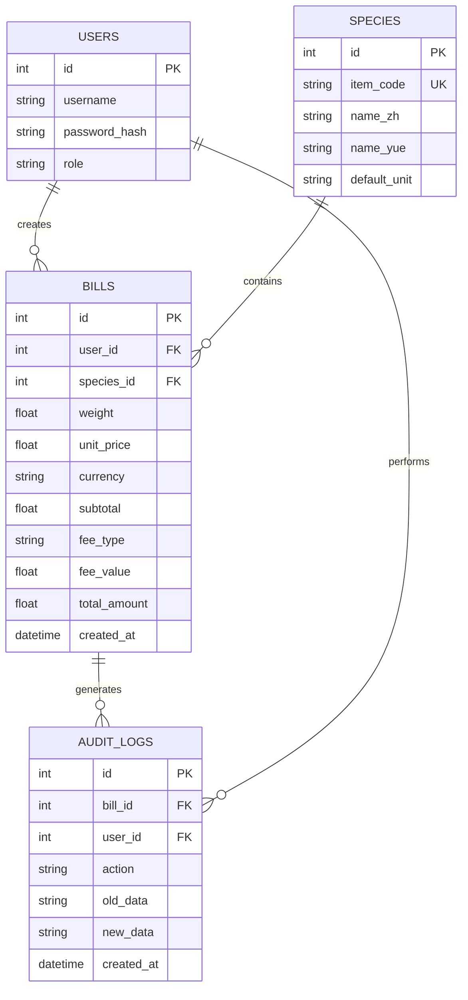

## 1. 架构设计



## 2. 技术说明

- **前端 (Frontend)**: Vue 3 (Composition API), Vite, Tailwind CSS, Vue Router, Pinia (状态管理), ECharts (图表), vue-i18n (实现国语与粤语双语切换)。
- **后端 (Backend)**: Python 3.10+, FastAPI, Pydantic (数据校验), SQLAlchemy (ORM)。
- **数据库 (Database)**: SQLite (默认开发使用，后续可无缝切换 PostgreSQL)。
- **UI 组件库**: Element Plus 或直接基于 Tailwind 封装敦煌佛教风格的基础组件。

## 3. 路由定义 (前端)

| 路由路径     | 页面用途               |
| ------------ | ---------------------- |
| `/login`     | 登录/注册页面          |
| `/dashboard` | 价格走势与统计看板     |
| `/species`   | 鱼类物命品种库管理     |
| `/billing`   | 单据录入与计算页       |
| `/bills`     | 历史单据查询与日志审计 |

## 4. API 定义 (后端)

```typescript
// 核心 API 示例
interface BaseResponse<T> {
  code: number;
  message: string;
  data: T;
}

// 鱼类品种
GET /api/species
POST /api/species (ItemCode, Name_zh, Name_yue, Unit)

// 录入单据
POST /api/bills
{
  "item_code": string,
  "weight": number,
  "unit_price": number,
  "currency": string,
  "service_fee_type": "PERCENTAGE" | "FIXED",
  "service_fee_value": number
}

// 获取价格走势 (近30天)
GET /api/stats/price-trend?item_code=string
```

## 5. 服务端架构图



## 6. 数据模型

### 6.1 数据模型定义 (ER图)



### 6.2 数据库 DDL (SQLAlchemy 简化版)

```sql
CREATE TABLE users (
    id INTEGER PRIMARY KEY AUTOINCREMENT,
    username VARCHAR(50) UNIQUE NOT NULL,
    password_hash VARCHAR(128) NOT NULL,
    role VARCHAR(20) NOT NULL
);

CREATE TABLE species (
    id INTEGER PRIMARY KEY AUTOINCREMENT,
    item_code VARCHAR(50) UNIQUE NOT NULL,
    name_zh VARCHAR(100) NOT NULL,
    name_yue VARCHAR(100) NOT NULL,
    default_unit VARCHAR(20) NOT NULL
);

CREATE TABLE bills (
    id INTEGER PRIMARY KEY AUTOINCREMENT,
    user_id INTEGER NOT NULL,
    species_id INTEGER NOT NULL,
    weight REAL NOT NULL,
    unit_price REAL NOT NULL,
    currency VARCHAR(10) NOT NULL,
    subtotal REAL NOT NULL,
    fee_type VARCHAR(20) NOT NULL,
    fee_value REAL NOT NULL,
    total_amount REAL NOT NULL,
    created_at DATETIME DEFAULT CURRENT_TIMESTAMP,
    FOREIGN KEY(user_id) REFERENCES users(id),
    FOREIGN KEY(species_id) REFERENCES species(id)
);

CREATE TABLE audit_logs (
    id INTEGER PRIMARY KEY AUTOINCREMENT,
    bill_id INTEGER NOT NULL,
    user_id INTEGER NOT NULL,
    action VARCHAR(50) NOT NULL,
    old_data TEXT,
    new_data TEXT,
    created_at DATETIME DEFAULT CURRENT_TIMESTAMP,
    FOREIGN KEY(bill_id) REFERENCES bills(id),
    FOREIGN KEY(user_id) REFERENCES users(id)
);
```
