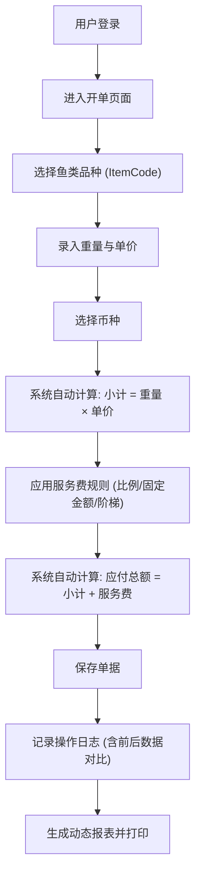

## 1. 产品概述

一款面向水产行业（特别是鱼类交易）的价格后台管理平台，支持国语与粤语双语切换。

- **主要目的**：解决鱼类交易中品种繁多、计价复杂、多币种结算及服务费计算易出错的问题。
- **目标用户**：水产批发商、零售商、财务人员及后台管理员。
- **产品价值**：通过准确的单据计算逻辑、防篡改的操作日志审计，以及直观的价格走势看板，提升交易效率，减少对账纠纷。

## 2. 核心功能

### 2.1 用户角色

| 角色              | 注册方式      | 核心权限                                       |
| ----------------- | ------------- | ---------------------------------------------- |
| 管理员 (Admin)    | 系统预设/邀请 | 用户管理、系统设置、基础数据维护、全量报表查看 |
| 操作员 (Operator) | 管理员分配    | 单据录入、品种查询、基础报表打印               |

### 2.2 功能模块

1. **认证模块 (Auth)**：用户注册、登录、登出。
2. **基础数据管理 (Master Data)**：物命品种库（ItemCode、中/粤语名称）、计价单位、币种符号维护。
3. **价格录入与单据计算 (Billing)**：
   - 重量录入（关联计价单位）
   - 单价录入（支持多币种）
   - 自动小计（重量 × 单价）
   - 服务费配置（按百分比或按固定金额，支持重量阶梯收费）
   - 应付总额（小计 + 服务费）
   - 操作日志审计（记录修改前后数据）
4. **报表与打印 (Reports & Print)**：动态生成业务单据并支持热敏/A4打印。
5. **统计分析看板 (Dashboard)**：品种价格走势（按 ItemCode 聚合近 30 天单价波动曲线）。

### 2.3 页面详情

| 页面名称             | 模块名称 | 功能描述                                                                     |
| -------------------- | -------- | ---------------------------------------------------------------------------- |
| 登录/注册页          | 认证模块 | 提供用户账号注册与登录功能，支持语言切换（国/粤）。                          |
| 统计看板 (Dashboard) | 价格走势 | 呈现核心业务数据，展示近30天品种单价波动折线图（ECharts）。                  |
| 物命品种库管理       | 基础数据 | 维护鱼类品种信息（ItemCode、名称、默认单位）。                               |
| 交易开单页           | 单据计算 | 录入重量、单价、币种，系统实时计算小计与服务费，展示最终总额，提供打印入口。 |
| 单据记录与日志       | 审计模块 | 查看历史单据，并展示单据修改前后的操作日志对比，防止纠纷。                   |

## 3. 核心流程

主要用户开单与结算流程：

## 4. 界面设计

### 4.1 设计风格

- **整体风格**：敦煌壁画风格、偏佛教美学。通过沉稳、古典、富有禅意的视觉语言传递专业与可靠。
- **主次色调**：
  - 主色：石青 (Azurite Blue)、石绿 (Malachite Green) 搭配土黄 (Earth Yellow) 作为背景底色，模拟壁画质感。
  - 点缀色：朱砂红 (Cinnabar Red) 用于强调或警示（如日志变更、重要金额）。
- **按钮样式**：圆润的边角，微透的磨砂玻璃质感或带有古典纹理的实体按钮，避免过于现代的锐利感。
- **字体及排版**：采用端庄的宋体或楷体作为标题字体，无衬线体作为数据展示字体以保证可读性。排版留白较多，体现佛教“空”与“禅”的意境。
- **图标/纹样**：融入莲花、祥云、宝相花等佛教与敦煌经典纹饰作为背景暗纹或图标元素。

### 4.2 页面设计概览

| 页面名称   | 模块名称       | UI 元素                                                                          |
| ---------- | -------------- | -------------------------------------------------------------------------------- |
| 全局框架   | 导航栏与侧边栏 | 顶部使用石绿色调，带有浅浅的祥云暗纹；侧边栏采用土黄色调，选中状态为朱砂红点缀。 |
| 统计看板   | 图表区         | 折线图采用敦煌色彩的渐变（如石青到石绿的过渡），数据提示框带有圆角和柔和阴影。   |
| 交易开单页 | 表单与计算区   | 卡片式布局，背景带有仿古纸张纹理，金额总计部分使用朱砂红放大显示。               |

### 4.3 响应式

- 桌面端优先，确保后台管理在宽屏显示器上的信息密度与操作效率。
- 核心开单页针对平板（如 iPad）进行触控优化，方便在档口或市场环境中快速录入。
